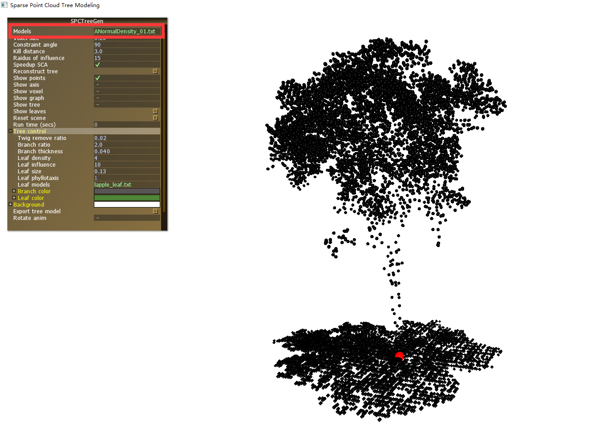
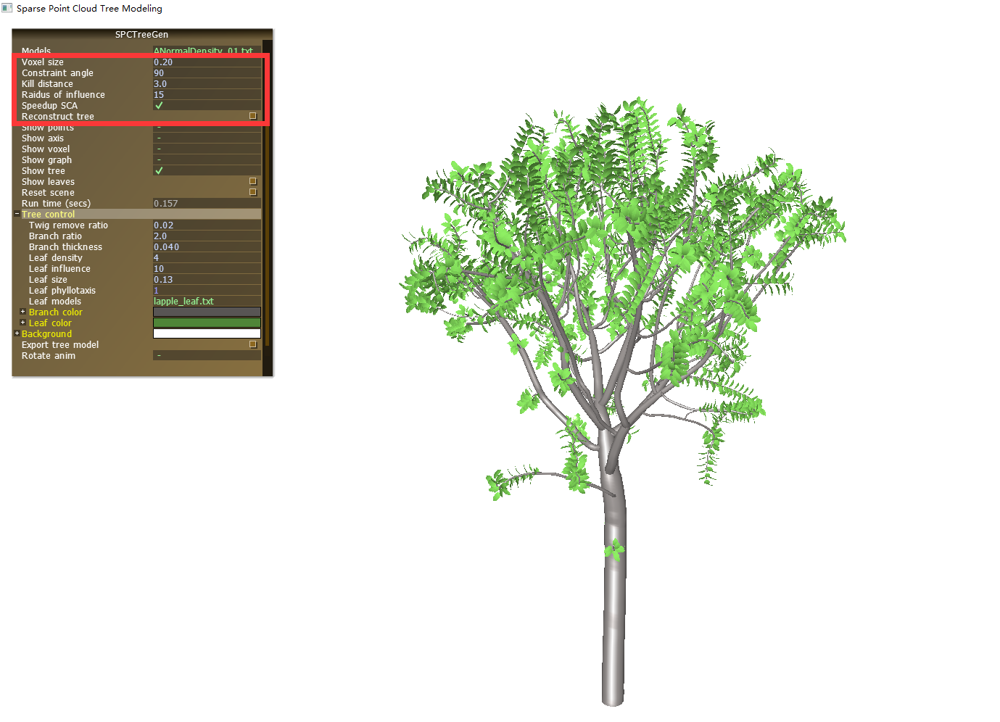
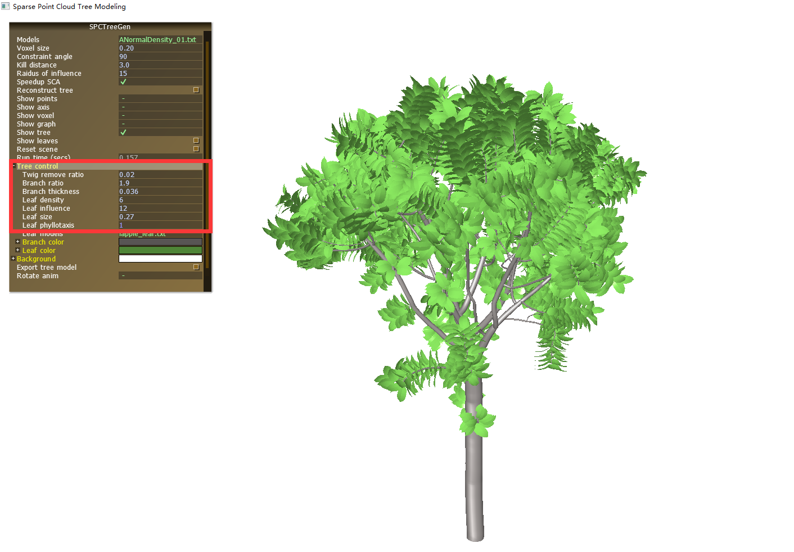
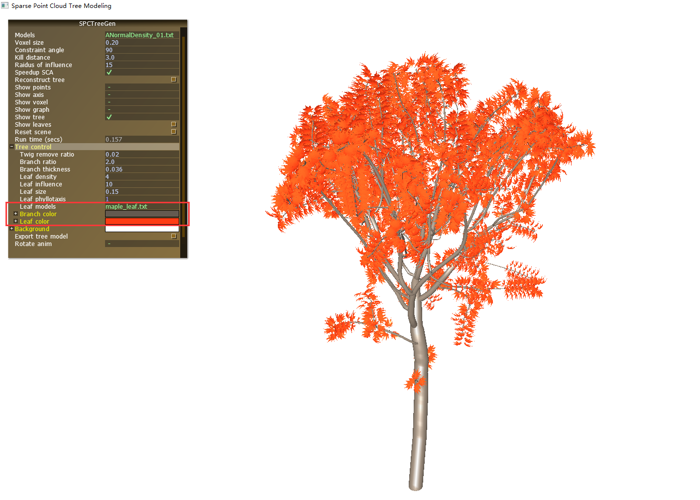

# 基于稀疏点云的树木三维重建软件使用说明

## 树点云三维重建

在基于稀疏点云的树木三维重建软件中，选定输入点云数据后，用户可以在参数栏中设置不同参数值，控制树干生长角度，树枝密度，树枝光滑度等，可以对树干和树叶选择不同的颜色。软件中预置了不同树叶模型供用户选择，通过调整参数，可将树木模型调整的更真实。以下为软件使用过程展示。

**步骤1：** 打开`Software`文件夹，双击可执行程序`3DTreeModelGen.exe`，在Models栏目后选择导出的树木点云文件，进行模型重建。软件可通过 'W'，'A'键控制俯仰角， 'S'，'D' 键控制左右旋转，'Q'，'E'键控制左倾右倾角度，'Z'，'X' 键控制缩放。

  
<b>图1</b> 选择要重建的树点云

 </b>步骤2：</b> 

1. 在图2红色框内设置不同的参数值，控制树干生长，点击Reconstruct tree重建树木（图2）。

<b>图2</b> 树点云重建过程展示

2. 在Tree control的栏目中手动调整树枝模型粗度以及叶片大小、密度等参数，可将模型调整的更具真实感（图3）。

<b>图3</b> 树点云重建效果展示（调整树枝及叶片参数）

3. 在Tree control的子栏目Leaf models中选取不同的叶片模型，使得重建出的树木模型具有不同风格。图4为枫叶模型对应的重建效果。

<b>图4</b> 树点云重建效果展示（使用枫叶模型）

