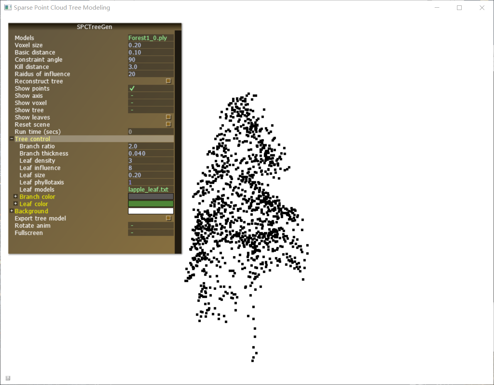
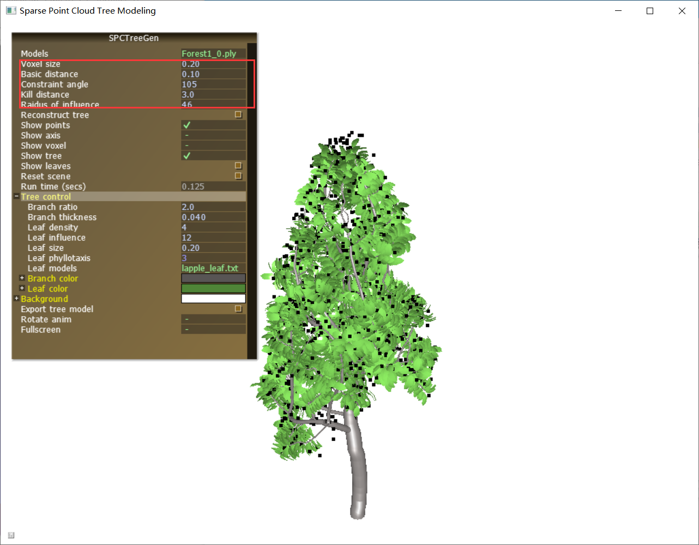
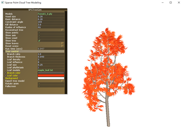

# 基于稀疏点云的树木三维重建软件使用说明

## 树点云三维重建
**步骤1：** 打开`Software`文件夹，双击可执行程序3DTreeModelGen.exe，在Models栏目后选择2.1中导出的点云，进行模型重建。软件可通过 'W'，'A'键控制俯仰角， 'S'，'D' 键控制左右旋转，'Q'，'E'键控制左倾右倾角度，'Z'，'X' 键控制缩放。

  <b>图1</b> 选择要重建的树点云

**步骤2：** 可以在红色框内设置不同的参数，控制树干生长，点击Reconstruct tree重建树木（图2）。

  <b>图2</b> 树点云重建过程展示

可以在Tree control的子栏目Leaf models中选取不同的叶片模型，使得重建出的树木模型具有不同风格。图8为枫叶模型对应的重建效果。

<b>图3</b> 树点云重建效果展示（使用枫叶模型）

用户可以在参数栏中设置不同参数，控制树干生长角度，树枝密度，树枝光滑度等。可以对树干和树叶选择不同的颜色。软件中预置了不同树叶模型供用户选择。
择不同的颜色。软件中预置了不同树叶模型供用户选择。
